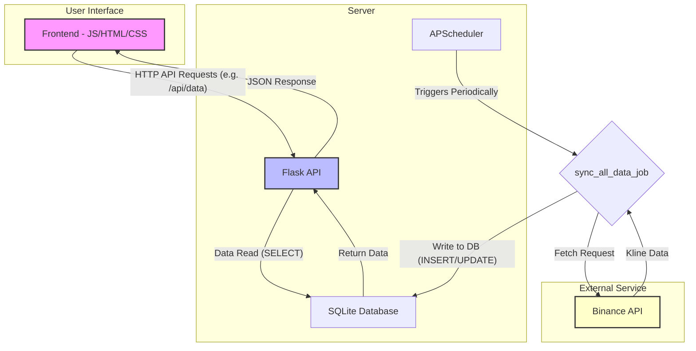
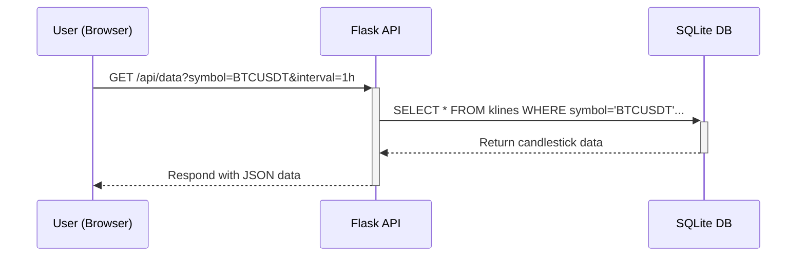
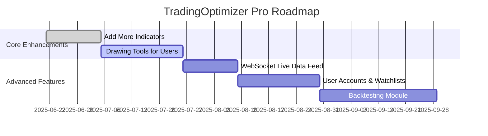

# 📊 TradingOptimizer Pro


**TradingOptimizer Pro** is an advanced financial analysis and charting platform developed using modern web technologies for the cryptocurrency markets. It helps users test and improve their trading strategies by providing detailed and interactive candlestick charts with various technical indicators.

Built upon a solid and scalable foundation using a **Flask**-based Python backend and a modular **JavaScript** frontend.

---

## ✨ Key Features

* **Interactive Candlestick Charts**: Smooth, zoomable, and scrollable charts rendered with ApexCharts.
* **Extensive Technical Indicator Support**:

  * **Overlay**: EMA (Exponential Moving Average), Bollinger Bands.
  * **Pane (Sub-chart)**: RSI (Relative Strength Index), MACD, Volume.
* **Customizable Indicators**: All indicators have adjustable settings like period and length in real time.
* **Modular & Extensible Architecture**: New indicators or features can be easily integrated thanks to the modular design.
* **Background Data Synchronization**: Market data is periodically fetched from Binance API and stored locally without affecting the user experience.
* **Live Watchlist**: Real-time prices and 24-hour change percentages are displayed for all supported symbols.

---

## 🛠️ Technologies Used

### Backend

* **Python 3**
* **Flask** – Lightweight and flexible web framework
* **Flask-APScheduler** – For background jobs and periodic tasks
* **SQLite** – Simple serverless database for development
* **Requests** – For sending HTTP requests to Binance API

### Frontend

* **Vanilla JavaScript (ES6+ Modules)**
* **ApexCharts.js** – Interactive charting library
* **Lucide Icons** – Modern and clean icon set
* **HTML5 & CSS3** – Responsive and modern interface

---

## 🏗️ Project Architecture

The application consists of three main components: **Frontend**, **Backend**, and **Scheduler**. The interaction between components is shown below:



---

## 🔄 Data Flow Example: Chart Loading



---

## 🚀 Setup & Run

Follow the steps below to run this project locally.

### Requirements

* Python 3.8+
* pip and venv

### Steps

```bash
# Clone the repository
git clone https://github.com/onur-karakus/tradingoptimizer.git
cd tradingoptimizer

# Create and activate virtual environment
python -m venv venv
source venv/bin/activate      # macOS/Linux
# venv\Scripts\activate       # Windows

# Install dependencies
pip install -r requirements.txt

# Initialize the database
flask init-db

# Fetch historical data
python data_fetcher.py

# Run the app
python run.py
```

Visit: [http://127.0.0.1:5000](http://127.0.0.1:5000)

---

## 🗺️ Future Development (Roadmap)



Feel free to open an issue or submit a pull request. Contributions are welcome!

---

## 📜 License

This project is licensed under the **MIT License**. See the `LICENSE` file for more details.

---

